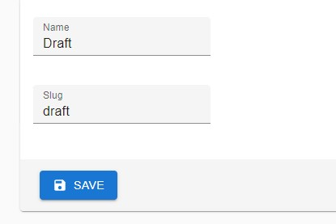
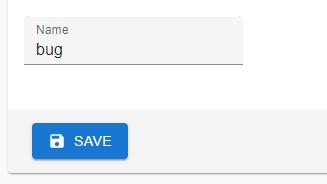
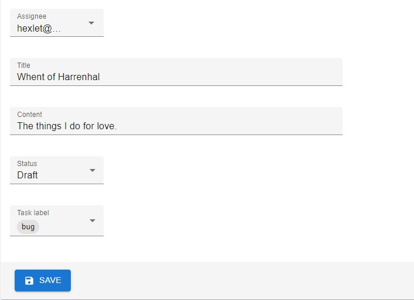
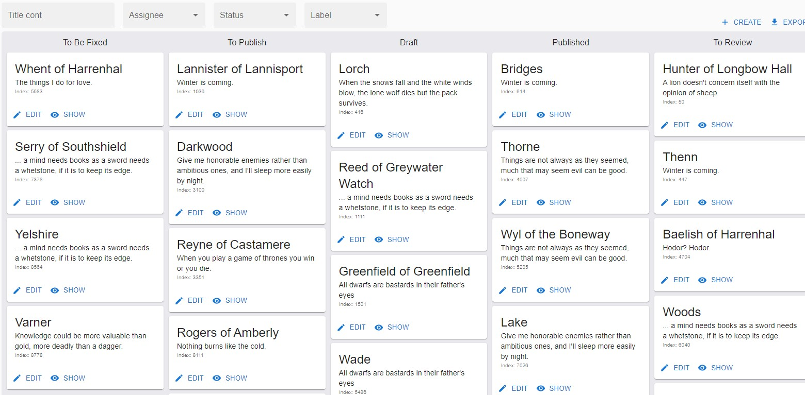

### Hexlet tests and linter status:

# Менеджер задач
## Описание
[Менеджер задач](https://java-project-99-kdqw.onrender.com) - представляет из себя доску с задачами. Здесь можно создавать задачи, статусы, метки.

# Возможности
1. Создаём статус
   

2. Создаём метку
   

3. Создаём задачу
   

4. Наслаждаемся удобным интерфейсом :)

### Авторизация
Для входа на сайт используйте логин: hexlet@example.com и пароль: qwerty
